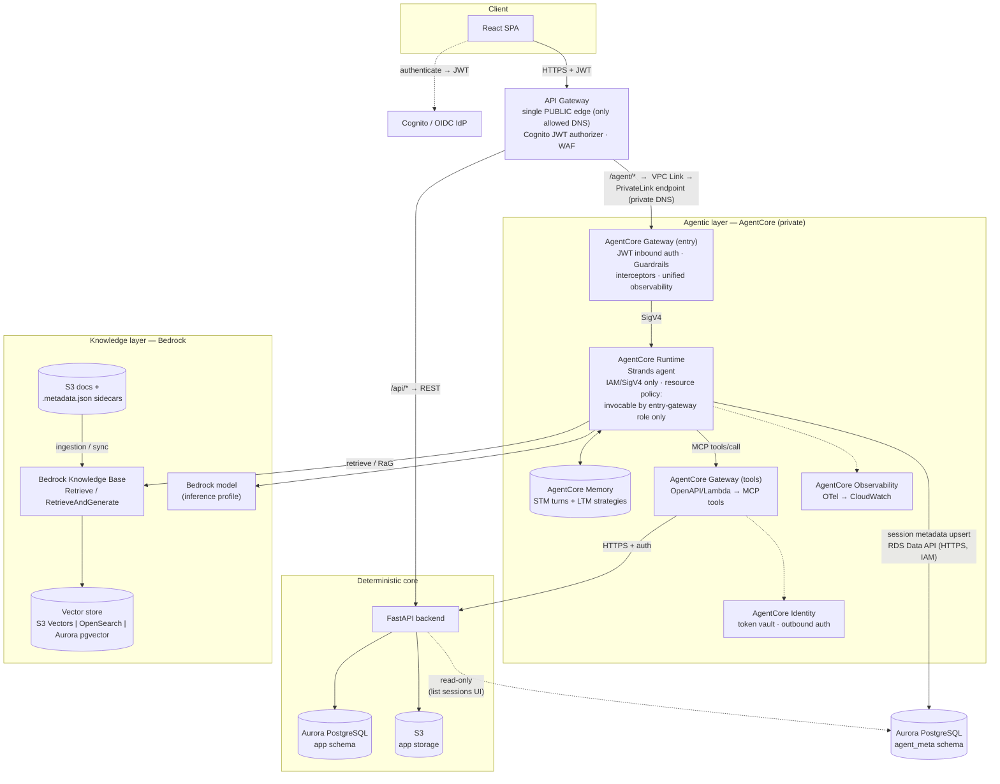

# System Architecture v2 — Gateway-Fronted AgentCore with Bedrock KB and Session Metadata

> **Status:** Greenfield target architecture (not tied to an existing project).
> Supersedes the earlier ADR's "Pattern A vs B" discussion: **Pattern B
> (Gateway in front of Runtime) is now the chosen pattern.**

## Scope of this revision

1. **API Gateway is the single public entry**; the **AgentCore Gateway sits
   behind it** (DNS restriction) and fronts the Runtime as the governed door.
2. **Sessions & memory** — owned by AgentCore (Runtime session isolation +
   managed Memory service).
3. **Knowledge Base** — Amazon Bedrock Knowledge Bases only, accessed via the
   native `Retrieve` / `RetrieveAndGenerate` APIs (no third-party RAG layer).
4. **Session metadata → Aurora PostgreSQL** — a queryable registry of
   *metadata about* sessions (never conversation content), written by the
   agent via the RDS Data API.

## System overview



`agent_meta` and `app` can share one Aurora cluster; they remain separate
schemas with separate DB roles (write: agent only; read: app only).

## Request flow (chat turn)

1. React obtains a JWT from the IdP and calls **API Gateway** — the only
   publicly resolvable endpoint (a corporate DNS restriction blocks the
   `*.bedrock-agentcore.amazonaws.com` domains). API Gateway validates the
   JWT (Cognito authorizer) and applies WAF at the edge.
2. API Gateway routes by path: `/api/*` → FastAPI; `/agent/*` → the
   **AgentCore entry Gateway**, reached privately over a **VPC Link →
   PrivateLink interface endpoint** (so even this hop uses private DNS, never
   the public AgentCore domain). The `Authorization` header is forwarded.
3. The entry Gateway re-validates the JWT (inbound auth — defense in depth),
   applies **Guardrails** and interceptors, then invokes the **Runtime** over
   SigV4. The Runtime's resource policy only admits the gateway's execution
   role — direct invocation is impossible.
4. Runtime builds the Strands agent: **Memory session manager** loads the
   turn history + long-term memories for `(actor_id, session_id)`.
5. The agent answers, using:
   - **Bedrock KB** for document questions (`Retrieve` or
     `RetrieveAndGenerate`, per `KB_MODE`),
   - **tools Gateway** for business data/actions → FastAPI (never direct DB),
   - the **Bedrock model** (inference profile) for reasoning.
6. Memory persists the turn (managed service).
7. Runtime **fire-and-forgets a metadata upsert** to
   `agent_meta.session_metadata` via the **RDS Data API** — session id, actor
   id, timestamps, turn count, model id. **No message content.** A failure
   here never fails the chat turn.

## Design review — decisions and their defence

| # | Decision | Why | Rejected alternative |
|---|----------|-----|----------------------|
| 1 | **API Gateway is the single public edge; AgentCore Gateway sits behind it** | DNS restriction: clients can't resolve the `*.bedrock-agentcore.amazonaws.com` endpoints, only the approved API Gateway domain. API Gateway also gives one place for WAF, edge JWT validation, throttling, and a stable custom domain | Exposing the AgentCore Gateway directly (earlier revision): blocked by the DNS policy, and would scatter edge concerns |
| 1a | API Gateway → entry Gateway over **VPC Link + PrivateLink** | Keeps the hop on **private DNS** inside the VPC (the whole point of the restriction); no public traversal. AgentCore exposes PrivateLink interface endpoints for exactly this | Public HTTP_PROXY integration to the AgentCore endpoint: violates the DNS restriction |
| 1b | Entry Gateway still fronts Runtime (Pattern B) | One policy-enforced door for Guardrails, interceptors, unified observability applied *outside* the agent; API Gateway is a DNS/edge layer, not a replacement for it | Collapsing entry Gateway into API Gateway: loses Guardrails/observability that only AgentCore Gateway provides |
| 2 | Runtime locked to IAM + resource policy | Fronting is only real if the front door can't be bypassed; SigV4-from-gateway-role-only enforces it | JWT directly on Runtime: valid, but then the gateway adds no security value |
| 3 | Two logical Gateways (entry vs tools) | Different jobs, different auth: inbound user JWT vs outbound tool credentials (Identity token vault). Separate resources keep policies minimal | One gateway doing both: possible, but blast radius and policy complexity grow |
| 4 | Bedrock KB via native APIs only | Fewer dependencies, first-class citations, Guardrails and reranking apply natively; the strands_tools wrapper adds a layer without adding capability | Third-party RAG stacks: more control, but you re-own chunking/ingestion/citations that Bedrock manages |
| 5 | Conversation content in AgentCore Memory only | Service isolation enforces the ownership boundary; retention/extraction are managed | Mirroring transcripts to Aurora: duplicates PII, creates two sources of truth, invites coupling |
| 6 | **Metadata** (not content) to Aurora | The app legitimately needs "list my conversations", activity stats, admin views — AgentCore Memory doesn't serve app UX queries. Metadata is small, non-sensitive, relational | Querying Memory for app UX: wrong tool; scraping live session state was already ruled out in the ADR |
| 7 | RDS Data API for the metadata write | HTTPS + IAM, zero connection pools, no VPC wiring on the Runtime for a tiny write path; PrivateLink-capable later | VPC mode + psycopg: right answer if the agent needs heavy/low-latency DB access — overkill for one upsert per turn |
| 8 | Write is async/best-effort | Metadata is an index, not the record of truth; a DB blip must not break chat | Synchronous required write: couples chat availability to Aurora availability |
| 9 | `agent_meta` schema, agent-writes / app-reads | Matches the ADR ownership rule; enforced with DB grants, not convention | FastAPI writing metadata on the agent's behalf: adds a hop and an API for data the agent already has |

## Bedrock Knowledge Base — best-practices checklist

**Ingestion**
- S3 data source with **`.metadata.json` sidecar files** per document
  (department, doc-type, effective-date…) to enable metadata filtering.
- Chunking: don't default blindly. **Semantic** or **hierarchical** chunking
  usually beats fixed-size for policy/manual-style corpora; validate against
  your documents.
- Scheduled or event-driven **sync jobs**; alarm on ingestion failures.

**Vector store** — three sane options, pick by constraint:
- **S3 Vectors** — cheapest, serverless; good default for moderate scale.
- **OpenSearch Serverless** — lowest latency, enables **HYBRID** (vector +
  keyword) search.
- **Aurora PostgreSQL (pgvector)** — reuses the cluster you already run;
  fewer moving parts, but couples KB load to your app DB. Viable here since
  Aurora is already in the design — isolate it (separate instance/ACU
  headroom) if chosen.

**Retrieval**
- `numberOfResults` 5–10; enable a **reranker model** if relevance is noisy.
- `overrideSearchType: HYBRID` where the store supports it.
- Use **metadata filters** to scope retrieval (tenant, department, date).

**Generation (RetrieveAndGenerate)**
- `modelArn` must be an **inference-profile ARN** for `us./eu./apac.` models.
- Apply **Guardrails** at generation; surface **citations** to the user.
- Multi-turn KB context uses Bedrock's own `sessionId` (server-generated;
  reuse, never invent). We deliberately do **not** thread it inside the
  agent — AgentCore Memory is the single continuity mechanism.

**Evaluation**
- Use Bedrock's RAG evaluation to score retrieval + generation before and
  after chunking/reranking changes; don't tune blind.

## Session metadata — data contract

```sql
CREATE SCHEMA IF NOT EXISTS agent_meta;

CREATE TABLE agent_meta.session_metadata (
    session_id        TEXT PRIMARY KEY,          -- AgentCore runtime session
    actor_id          TEXT        NOT NULL,      -- end user
    memory_id         TEXT,                      -- AgentCore Memory resource
    model_id          TEXT,                      -- model used
    status            TEXT        NOT NULL DEFAULT 'active',
    turn_count        INTEGER     NOT NULL DEFAULT 0,
    started_at        TIMESTAMPTZ NOT NULL DEFAULT now(),
    last_activity_at  TIMESTAMPTZ NOT NULL DEFAULT now(),
    attributes        JSONB       NOT NULL DEFAULT '{}'::jsonb
);

CREATE INDEX idx_session_meta_actor
    ON agent_meta.session_metadata (actor_id, last_activity_at DESC);
```

Rules:
- **Never** store prompts, responses, or extracted memories here.
- One upsert per turn: `ON CONFLICT (session_id) DO UPDATE` bumping
  `turn_count` and `last_activity_at`.
- Grants: agent role `INSERT/UPDATE/SELECT` on `agent_meta`; app role
  `SELECT` only; neither role touches the other's schema.

## Known risks / open items

- **Two-layer edge auth.** API Gateway and the entry Gateway both validate
  the JWT. That's intentional defense-in-depth, but confirm the token is
  forwarded intact and decide whether to also do request signing between
  them. If the latency of three proxy hops (API GW → entry Gateway → Runtime)
  matters, measure it before optimising.
- **PrivateLink regional availability.** AgentCore interface (PrivateLink)
  endpoints aren't in every region yet — verify your target region supports
  them, since the DNS restriction makes this hop mandatory, not optional.
- **Entry-gateway JWT specifics** (claims mapping, per-agent authorization)
  need a concrete IdP design — Cognito assumed, not decided.
- **Vector store choice** is deferred until corpus size/latency targets are
  known; the diagram shows all three candidates.
- **Data API regional availability & quotas** — verify in your target region
  and load-test the per-turn upsert (batch or sample if chat volume is high).
- **RaG vs Retrieve inside an agent**: RaG double-generates by construction.
  If the agent orchestrates many tools per turn, prefer `KB_MODE=retrieve`
  and let the agent's model generate once.
