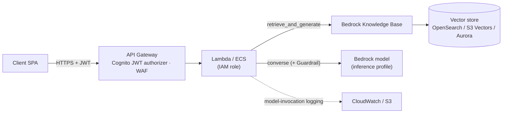
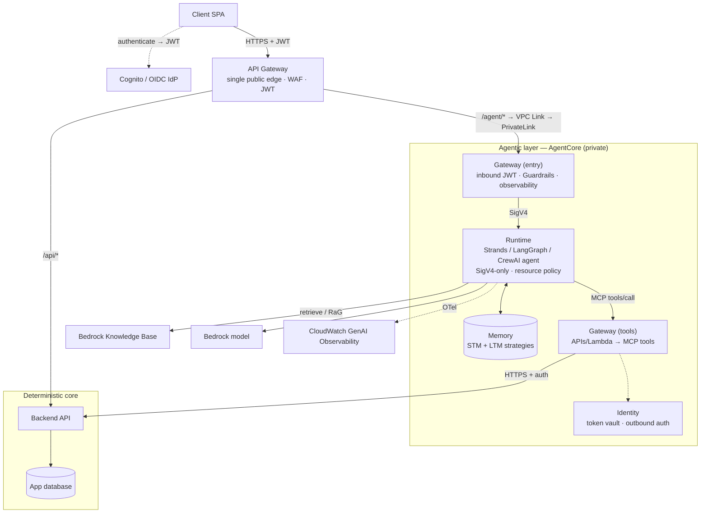

# Architecture & Design — Bedrock + AgentCore

> **Scope:** How to shape a system on Amazon Bedrock and AgentCore — reference
> architectures, the deterministic/agentic split, model selection, cost, and the
> Well-Architected lenses. Concept-level guidance; the mechanics live in the numbered
> topic files. Current as of July 2026.

## 1. The one principle everything else hangs off

Separate **deterministic** logic from **probabilistic** logic. An agent's output is a
*sample*, not a guarantee — anything that must be correct every time (money movement,
permission checks, referential integrity) belongs behind a conventional, testable, versioned
API. The agent orchestrates and reasons; it does **not** own business invariants, and it
reaches your data **through your APIs** (surfaced as tools via Gateway), never by opening a
database connection.

This repo already argues the case in depth in
[`../Plan/agentcore-vs-backend.md`](../Plan/agentcore-vs-backend.md); the table below is the
compressed version.

| Property | Backend API (e.g. FastAPI) | Agent (AgentCore Runtime) |
|---|---|---|
| Behavior | Deterministic, repeatable | Non-deterministic, model-driven |
| Correctness | Provable, unit-testable | Evaluated, not proven |
| Transactions | ACID, first-class | Delegates to the API |
| Failure mode | Explicit errors | Hallucination, drift, retries |
| Change cadence | Versioned releases | Prompt/model/tool iteration |

## 2. Reference architecture A — RAG chatbot (no agent framework)

The simplest useful shape: a stateless request path over Bedrock Knowledge Bases and the
Converse API. No AgentCore required.

Use it when the workload is document Q&A. Stream with `retrieve_and_generate_stream` or
`converse_stream`. Everything about the KB is in
[`06-rag-and-knowledge-bases.md`](06-rag-and-knowledge-bases.md); guardrails in
[`07-guardrails-and-pii.md`](07-guardrails-and-pii.md).

## 3. Reference architecture B — gateway-fronted AgentCore (agentic)

When the workload needs tools, memory, and multi-step reasoning, host the agent on AgentCore
Runtime and put a Gateway in front as the single governed door. This is the pattern developed
concretely, with a full Mermaid diagram and a 9-row decision table, in
[`../Plan/architecture-v2.md`](../Plan/architecture-v2.md) — read that for the defended
version. The essentials:

Two roles for Gateway that must not be collapsed into one arrow: it is primarily the agent's
**outbound tool layer** (`RT → TOOLS`), and it *can also* be the **inbound governed entry**
(`ENTRY → RT`). If you use the entry role, lock the Runtime to SigV4 and a resource policy so
only the gateway's execution role can invoke it — otherwise the governed door is bypassable
(see [`08-security-roles-and-permissions.md`](08-security-roles-and-permissions.md)).

## 4. Reference architecture C — agentic RAG / multi-agent

For research-style workloads, a supervisor agent decomposes the task and dispatches
collaborator agents (or sub-graphs), each with its own tools and KB scope. Cross-agent calls
use the **A2A** protocol; tools are **MCP**. Keep long runs on the Runtime async path (up to
8 hours) and propagate one trace across every hop (see
[`10-observability-tracing-logs-monitoring.md`](10-observability-tracing-logs-monitoring.md)).
Decomposition and parallel retrieval are in
[`06-rag-and-knowledge-bases.md`](06-rag-and-knowledge-bases.md).

## 5. Protocols: MCP and A2A

- **MCP (Model Context Protocol)** — the standard for exposing *tools* to an agent. AgentCore
  Gateway speaks MCP: your APIs/Lambdas become MCP tools, and any MCP-compatible client (or
  another agent) can call them. Prefer MCP over bespoke tool schemas so tools are reusable
  across frameworks.
- **A2A (Agent-to-Agent)** — the standard for *agents calling agents*. Supported by Runtime
  since GA. Use it for multi-agent orchestration instead of wrapping one agent's HTTP endpoint
  as an ad-hoc tool.

## 6. Model selection

Match modality, reasoning need, latency, and cost. Start small and escalate only where quality
demands it; measure with Bedrock evaluation before swapping.

| Family | Sweet spot | Notes |
|---|---|---|
| **Anthropic Claude** (Opus / Sonnet / Haiku) | Top reasoning, agents, coding, tool use | Haiku for cheap/fast turns; Sonnet as the default workhorse; Opus for the hardest reasoning. |
| **Amazon Nova** (Micro / Lite / Pro) | Price-performance, multimodal | Nova Lite/Micro for high-volume classification/extraction; Pro for multimodal. |
| **Amazon Titan** | Embeddings, image | `titan-embed-text-v2` is the KB default (see `06`). |
| Third-party (Meta Llama, Mistral, …) | Specific licensing/latency needs | All behind the same Converse schema. |

Design rule: **default to Converse + a small model + guardrails + logging**, then escalate the
model per route where evaluation shows you must.

## 7. Cost optimization (design-time levers)

Ordered by typical impact:

1. **Right-size the model** — the single biggest lever. Route cheap intents to Haiku/Nova Lite.
2. **Prompt caching** — tag stable prefixes (system prompt, RAG context, tool defs) with a
   `cachePoint`; up to ~90% input-token cost and ~85% latency reduction on cache hits (~5-min
   sliding TTL). Monitor `cacheReadInputTokenCount` / `cacheWriteInputTokenCount`.
3. **Batch inference** — asynchronous, cheaper per token; use for offline/bulk jobs.
4. **Cross-Region Inference (CRIS)** — geographic/global inference profiles raise throughput
   and dodge `503`s during bursts; requires the two-ARN IAM policy (see `08`).
5. **S3 Vectors** for the vector store — ≈90% cheaper than OpenSearch for infrequent-query RAG.
6. **Smaller embedding dimensions** — Titan v2 at 512 dims keeps ~99% accuracy for ~50%
   storage; 256 dims ~97% for ~75% savings.
7. **AgentCore Runtime** bills active CPU — you generally are not charged while the model is
   thinking (LLM I/O wait), so latency-bound agents are cheaper than they look.

On AgentCore Runtime specifically, treat compute as ephemeral and push durable state to Memory;
don't pay to keep a microVM warm holding state a managed service already holds.

## 8. Well-Architected: the two lenses to run

AWS publishes two lenses that apply directly here — review against both.

- **Generative AI Lens** — the GenAI lifecycle (scoping → model selection → customization →
  integration → deployment → continuous improvement) across the six pillars, plus a
  Responsible-AI dimension. Best-practice IDs like `GENCOST01-BP01` (right-size the model),
  `GENSEC*`, `GENOPS*`.
- **Agentic AI Lens** — agent-specific concerns: identity layering (`AGENTSEC03-BP03`), agent
  operations and tracing (`AGENTOPS05-BP01`), and agent performance (`AGENTPERF01-BP02`,
  enable Transaction Search). Referenced throughout `08` and `10`.

## Do

- Split deterministic (API) from probabilistic (agent); route business writes through the API.
- Pick the smallest model that passes evaluation for each route; default to Converse.
- Enable prompt caching on stable prefixes and model-invocation logging from day one.
- Front the Runtime with a Gateway *and* lock the Runtime so the door can't be bypassed.
- Run both Well-Architected lenses before go-live.

## Don't

- Don't use AgentCore Runtime as a general-purpose CRUD backend.
- Don't let the agent hold ACID transactions or touch the app database directly.
- Don't build **new** agents on Bedrock Agents "Classic" — it closes to new customers
  2026-07-30; use AgentCore + a framework.
- Don't over-provision a large model on every route "to be safe" — measure, then escalate.

## Sources

- [Well-Architected Generative AI Lens](https://docs.aws.amazon.com/wellarchitected/latest/generative-ai-lens/generative-ai-lens.html) · [model selection / cost `GENCOST01`](https://docs.aws.amazon.com/wellarchitected/latest/generative-ai-lens/gencost01.html)
- [Well-Architected Agentic AI Lens](https://docs.aws.amazon.com/wellarchitected/latest/agentic-ai-lens/)
- [Amazon Bedrock model catalog](https://aws.amazon.com/bedrock/amazon-models/) · [choose a generative-AI service](https://docs.aws.amazon.com/decision-guides/latest/generative-ai-on-aws-how-to-choose/guide.html)
- [Prompt caching](https://aws.amazon.com/bedrock/prompt-caching/) · [effective prompt caching](https://aws.amazon.com/blogs/machine-learning/effectively-use-prompt-caching-on-amazon-bedrock/)
- [Cost-optimization strategies for Amazon Bedrock](https://aws.amazon.com/blogs/machine-learning/effective-cost-optimization-strategies-for-amazon-bedrock/)
- [Geographic cross-Region inference](https://docs.aws.amazon.com/bedrock/latest/userguide/geographic-cross-region-inference.html)
- [Amazon Bedrock AgentCore GA (A2A, MCP targets)](https://aws.amazon.com/about-aws/whats-new/2025/10/amazon-bedrock-agentcore-available/)
- Repo: [`../Plan/agentcore-vs-backend.md`](../Plan/agentcore-vs-backend.md) · [`../Plan/architecture-v2.md`](../Plan/architecture-v2.md)
