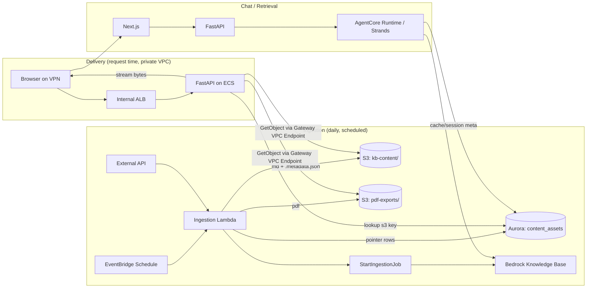

# RAG Ingestion & Citation Delivery (PDF/Preview) — Architecture Reference

Status: Design reference (no code, describes intended architecture)
Scope: Ingestion pipeline (Lambda → S3 → Bedrock KB), and citation delivery (PDF download + Markdown preview) for a private, VPN-only, no-public-internet deployment.
Related: extends the existing AgentCore/Strands architecture (Next.js chat → FastAPI on ECS → AgentCore Runtime → Bedrock KB; Aurora PostgreSQL for session/message/compliance data).

---

## 1. System Overview



Two independent lifecycles:
- **Ingestion** runs once a day, is batch-oriented, and is the only writer to `kb-content/` and `pdf-exports/`.
- **Delivery** runs per user request, is read-only against S3, and is the only path that serves bytes to a browser.

Nothing in this design is publicly routable. No CloudFront, no public S3 access, no presigned URLs handed to the browser.

---

## 2. S3 Layout & Bedrock KB Scoping

```
s3://<bucket>/
  kb-content/
    <doc_id>/<content_hash>.md
    <doc_id>/<content_hash>.md.metadata.json
  pdf-exports/
    <doc_id>/<content_hash>.pdf
```

**Why content-hash-keyed, not `<doc_id>.md` overwritten in place:**
- Enables safe `Cache-Control: immutable` — a given key's content never changes, only the pointer (in Aurora) moves to a new key.
- Gives free version history for compliance, without extra tooling.
- Lets the Lambda skip regeneration and re-ingestion entirely when content is unchanged (hash comparison), saving both compute and Bedrock KB embedding cost.
- Old hashes are cleaned up via an **S3 Lifecycle rule** (e.g., expire non-referenced objects after 30–90 days) rather than managed manually.

**KB scoping — the actual answer to "can the KB ignore the PDFs":**
Bedrock KB S3 data sources filter by **prefix**, not file extension. Configure the data source with:
```
inclusionPrefixes: ["kb-content/"]
```
`pdf-exports/` is never in scope for ingestion — no crawling, no duplicate chunks, no wasted embedding spend. This is a one-time data-source configuration, not something enforced per-file.

---

## 3. Ingestion Lambda — Behavior

Trigger: EventBridge Schedule, once daily (existing).

Per-document steps:
1. Fetch content from external API.
2. Transform to Markdown.
3. Compute `content_hash` (e.g., SHA-256 of normalized Markdown).
4. **Compare against Aurora's stored hash for this `doc_id`.**
   - Unchanged → skip regeneration and re-ingestion for this document entirely.
   - Changed / new → continue.
5. Upload `kb-content/<doc_id>/<hash>.md` + `.metadata.json`.
6. Convert Markdown → PDF, upload `pdf-exports/<doc_id>/<hash>.pdf`.
   - Set `Cache-Control: public, max-age=86400, immutable` on both objects at upload time.
7. Upsert Aurora pointer row (see §5) with the new hash/keys.

**Idempotency / partial failure:**
- Process per-document, not as a single all-or-nothing batch — one document's PDF conversion failure shouldn't block markdown upload or KB ingestion for the rest.
- Decide explicitly: KB `StartIngestionJob` should fire even if some PDFs failed to generate (KB freshness isn't blocked by PDF conversion). Log/alarm PDF failures separately (see §8).
- Because steps are keyed by content hash, a retried/re-run Lambda naturally no-ops on already-processed documents.

**Networking:** Lambda should run inside the VPC, using the same S3 Gateway Endpoint and a Bedrock Interface Endpoint (if not already in place), rather than routing through a NAT Gateway to reach public AWS endpoints — consistent with the "nothing public" constraint.

---

## 4. Delivery Path (PDF Download + Markdown Preview)

**No CloudFront, no signed URLs to the browser.** FastAPI is the only S3 client; the browser never talks to S3 directly.

```
Browser (VPN) → ALB (existing) → FastAPI (ECS, existing)
                                    → Aurora: resolve doc_id → s3_key
                                    → S3 GetObject via S3 Gateway VPC Endpoint (free, private)
                                    → StreamingResponse back to browser
```

**Why a Gateway Endpoint, not an Interface Endpoint:**
S3 is one of the few services with both endpoint types. Gateway Endpoints are route-table based, keep traffic entirely within the AWS private network, and have **no hourly or per-GB charge**. Interface Endpoints cost ~$0.01/hr per AZ plus data processing fees — there's no reason to pay for that when Gateway Endpoints cover S3 fully.

**Implementation notes:**
- Use `StreamingResponse` (stream the S3 `Body`) rather than buffering the full object in memory — lower ECS task memory pressure under concurrent downloads, and the user starts receiving bytes immediately (matters for large PDFs and perceived latency).
- Set `Content-Disposition: attachment; filename="..."` for downloads, inline for preview if ever needed.
- Access control is just the existing FastAPI session/auth check before streaming — no S3-level signing needed since the bucket is never reachable except from inside the VPC via the app.

**Markdown preview modal:**
Same path, different object: FastAPI fetches the `.md` object and returns it as text/JSON; Next.js renders it client-side in a modal (e.g. `react-markdown`).
> **Security note:** the source is an external API — treat Markdown as untrusted input. Ensure raw HTML passthrough is disabled in the renderer, or run content through a sanitizer (e.g. `rehype-sanitize`). Otherwise this is a stored-XSS path from the external content source into the chat UI.

---

## 5. Aurora's Role: Pointers, Not Blobs

**Do not store PDF/Markdown bytes in Aurora.** Reasons:
- Aurora storage costs materially more per GB-month than S3; every write also generates WAL replicated to readers and included in backups.
- The OLTP cluster is serving latency-sensitive session/message/compliance workloads — binary downloads competing for buffer cache and I/O is an unnecessary risk to that workload.
- S3 already provides `ETag`, `Range` (resumable downloads), and `Content-Disposition` — reimplementing these in Postgres is wasted effort.
- Large `bytea` rows regenerated daily churn the table and drive autovacuum overhead for no query benefit.

**What Aurora stores instead** — a lightweight table, e.g. `content_assets`:

| column | purpose |
|---|---|
| `doc_id` | logical document identifier (matches KB metadata) |
| `content_hash` | current hash, used for change detection and cache-safety |
| `s3_key_markdown` | current `kb-content/...` key |
| `s3_key_pdf` | current `pdf-exports/...` key |
| `generated_at` | last successful ingestion timestamp |

FastAPI resolves a citation → looks up this row (fast, indexed, tiny) → issues the S3 `GetObject` for the *current* key. This keeps Aurora doing what it's good at (fast metadata/joins with session data) and S3 doing what it's good at (cheap durable blob storage).

---

## 6. Caching Strategy (24h target, no CDN)

Layered, cheapest-first:

1. **Browser cache** — `Cache-Control: public, max-age=86400, immutable` on FastAPI's response (safe because of content-hash keying — a changed document gets a new key, so a cached copy under an old key is simply never referenced again, never served stale under a reused name).
2. **Optional in-process cache** — a small LRU/TTL cache inside each FastAPI/ECS task (keyed by `doc_id` + `content_hash`), TTL ~24h. Since content changes at most once a day, cross-task coherency isn't a real risk: worst case is one redundant S3 GET per task per document per day, which at S3 request pricing is effectively free even at scale.
3. **Skip ElastiCache/Redis unless metrics justify it.** It's the one component here with an ongoing dollar cost for infrastructure that would sit mostly idle given daily-refresh content. Add it only if observed load (very high task count × very large document set) shows the free tiers above aren't enough.

---

## 7. IAM — Least Privilege

Keep ingestion and delivery roles separate even though both touch the same bucket:

- **Ingestion Lambda role:**
  - `s3:PutObject` scoped to `kb-content/*` and `pdf-exports/*` only.
  - `bedrock:StartIngestionJob` scoped to the specific KB / data source ARN.
  - No `GetObject` needed beyond its own writes (it generates content in-memory, doesn't need to read back).
- **FastAPI/ECS task role:**
  - `s3:GetObject` scoped to `kb-content/*` and `pdf-exports/*` only.
  - **No `PutObject`** — delivery is read-only; only the ingestion Lambda writes.
- A bug in the read path can't write, and a bug in the write path can't be triggered by user requests. Keep this separation even if it feels redundant early on.

---

## 8. Observability

- **Ingestion Lambda failures** — standard CloudWatch alarm.
- **KB ingestion job status** — `StartIngestionJob` succeeding is not the same as the job succeeding. Poll or subscribe to job completion status; alarm on `FAILED`.
- **PDF conversion failures** — alarm separately from markdown/KB ingestion failures (per §3, these shouldn't block KB freshness, but shouldn't be silent either).
- **"Pointer exists, object missing"** — a metric/alarm for the case where Aurora has a `content_assets` row but the corresponding S3 `GetObject` 404s. This is the most likely real-world drift point (the seam between Aurora's view of the world and S3's actual state) and is otherwise invisible until a user hits a broken download link.

---

## 9. Explicitly Rejected Alternatives (and why)

| Option | Rejected because |
|---|---|
| CloudFront + signed URLs/cookies | Edge locations are on AWS's public network; violates the "nothing public" constraint even with WAF IP-allowlisting. |
| CloudFront VPC Origins | Private origin, but the distribution's edge domain is still publicly routable — same objection. |
| Presigned S3 URLs handed to the browser | Requires the client's own DNS/VPN split-tunnel to route `s3.<region>.amazonaws.com` privately — fragile per-device dependency; also fragments CDN/browser caching via the signature query string. |
| Storing PDF/Markdown bytes in Aurora | More expensive per GB than S3, competes with OLTP workload for I/O/buffer cache, no native file semantics (Range, ETag), unnecessary autovacuum churn. |
| S3 Interface VPC Endpoint (instead of Gateway) | Works, but has an hourly + data processing cost; Gateway Endpoint covers S3 fully for free. |
| On-demand PDF conversion in Next.js API routes | Poor fit for binary rendering — cold starts, bundle size for a headless renderer, timeout risk. If on-demand conversion is ever needed as a cache-miss fallback, it belongs in FastAPI/a dedicated Lambda, not Next.js. |

---

## 10. Open Items / Suggested Next Steps

- [ ] Confirm whether an S3 Gateway VPC Endpoint already exists in the target VPC, or needs to be provisioned.
- [ ] Confirm Bedrock Interface VPC Endpoints are in place for `bedrock-runtime` / `bedrock-agent-runtime` (used by AgentCore/Strands), consistent with the "nothing public" constraint.
- [ ] Define the `content_assets` table migration (Aurora) alongside existing session/message schema.
- [ ] Decide the Markdown sanitization approach for the preview modal (`rehype-sanitize` or equivalent) before enabling raw external content rendering.
- [ ] Decide S3 Lifecycle policy window for expiring superseded content-hash objects (proposed: 30–90 days).
- [ ] Add the "pointer exists, object missing" metric to existing observability/alerting stack.
